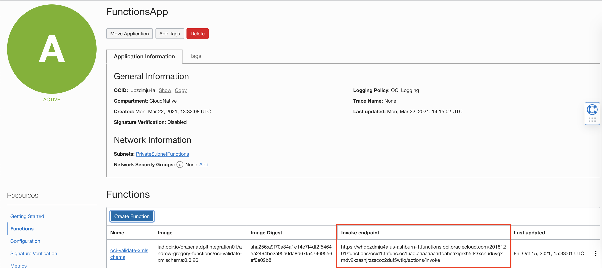
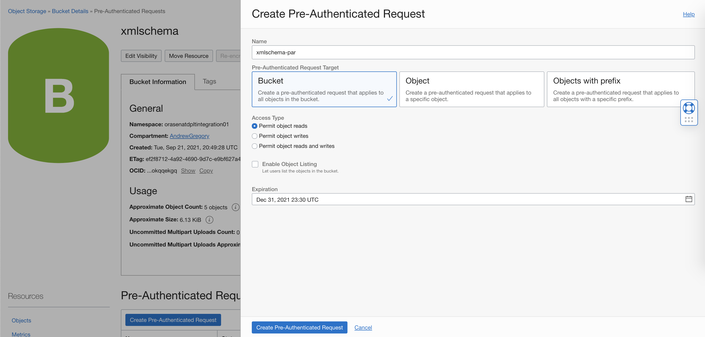
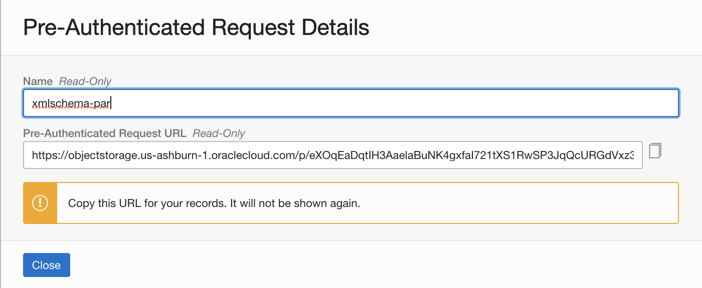
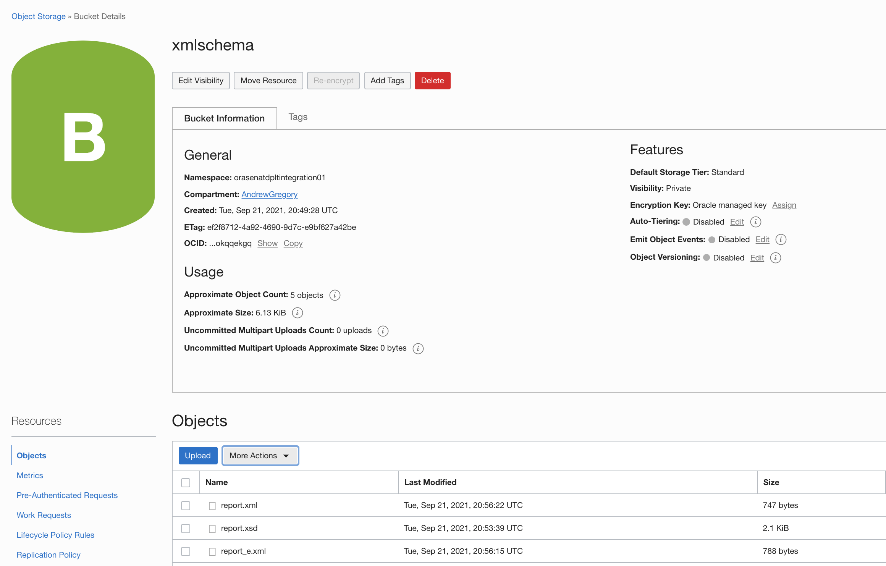
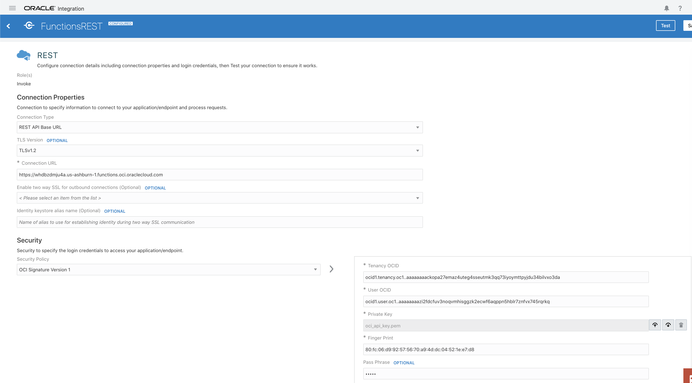
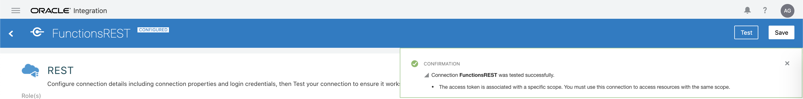
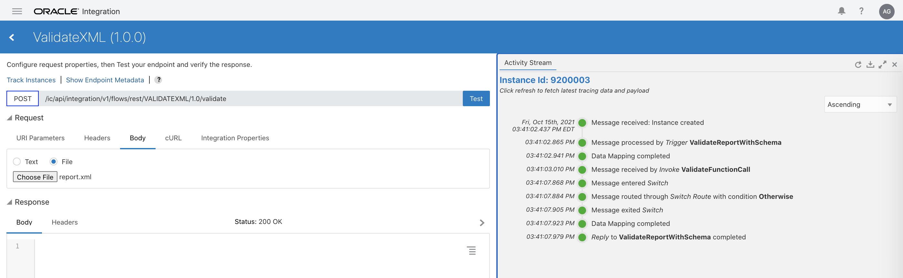
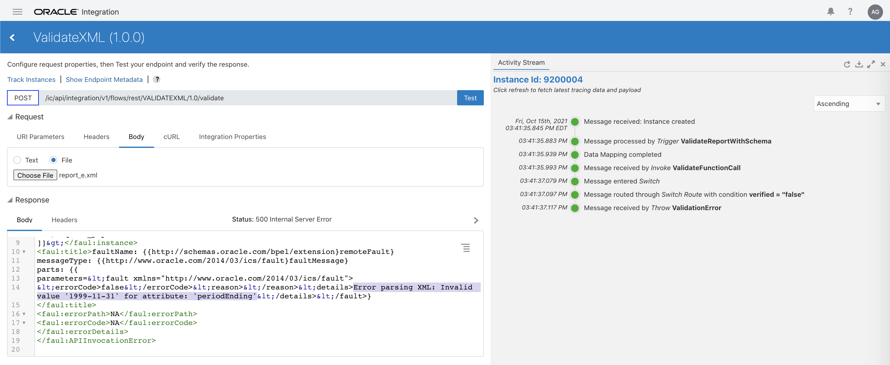
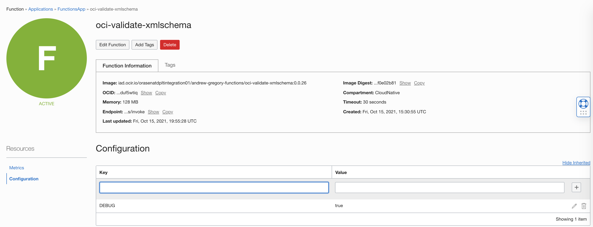

# XML Validation Function (JAVA)

This OCI Function allows for strict XML Validation using XSD Schemas.  The code implements the Oracle XML Developers Kit APIS for XML and XSD creation and validation.  These classes are added to the POM file to allow us to access the code. Because Oracle Functions favor JSON for input and output, this function requires the XML and XSD to be passed in as either a URL where they are locatede, or a base64-encoded string that will be converted to a String and then into an XML Document before validation.  The output of the function is a "verified flag" (boolean) and a message detail (string):
```
{"verified":true,"detail":"Parsed ok:"}
```
or for failure,
```
{"verified":false,"detail":"Error parsing XML: Invalid value '1999-11-31' for attribute: 'periodEnding'"}
```
When called from external entities, the JSON can be processed this way.  For example, to call from OIC,
- Use the REST Adapter
- Configure OCI Security v1 profile
- Call the Function invoke endpoint directly
- Use JSON samples above / below to configure OIC

More information here:
https://docs.oracle.com/en-us/iaas/Content/Functions/Tasks/functionsintegratingwithother.htm

## Deployment

[Functions Quickstart Guide](https://docs.oracle.com/en-us/iaas/Content/Functions/Tasks/functionsquickstartguidestop.htm)


1) Clone this repo on to your local computer or Cloud Shell.
2) Ensure that the Functions context is set up properly
3) Ensure that you have a valid Functions Application within your tenancy
4) cd into this cloned repository and execute:
```bash
fn -v deploy --app <Name of Functions Application> .
```

Completed Function application with invoke URL highlighted:



## Function Configuration

The configs available are:
- DEBUG - prints more output to the returned JSON output
- (future) PAR_FOLDER - would allow for configuration of base bucket/folder, so that you simply refer to an XSD by name and the rest of the path is built

## Object Storage bucket and PAR

Create a Bucket for XML and XSD storage.   Note that execution from somewhere such as OIC will not require XMLs in the bucket, as those will be generated within OIC.  The XSD is stored in the bucket for convenience.

Refer to this screenshot for PAR creation:


Output:

The PAR Folder will look like this:
```
https://objectstorage.us-ashburn-1.oraclecloud.com/p/eXOqEaDqtIH3AaelaBuNK4gxfaI721tXS1RwSP3JqQcURGdVxz3qpYAojJsfg-ZZ/n/orasenatdpltintegration01/b/xmlschema/o/
```
Simply add the file name to the end to form a fully qualified path for an XSD that is in that bucket.

Bucket Contents:


## Invocation Examples (command line)

Following are some examples for invoking the function from a command line environment.

### Using URLs for inputXML and inputXSD

These are Pre-Authenticated Requests (PARs) from Oracle Cloud Storage - bucket "xmlschema"

```bash
{"inputXML":"https://objectstorage.us-ashburn-1.oraclecloud.com/p/eXOqEaDqtIH3AaelaBuNK4gxfaI721tXS1RwSP3JqQcURGdVxz3qpYAojJsfg-ZZ/n/orasenatdpltintegration01/b/xmlschema/o/report_e.xml","inputXSD":"https://objectstorage.us-ashburn-1.oraclecloud.com/p/eXOqEaDqtIH3AaelaBuNK4gxfaI721tXS1RwSP3JqQcURGdVxz3qpYAojJsfg-ZZ/n/orasenatdpltintegration01/b/xmlschema/o/report.xsd"}
```
### Using Base64 encoding with HERE-doc
Here we take XML and XSD and export them into Base64 strings, then pass them into the function

```bash
export XML=$(cat report.xml|base64)
export XSD=$(cat report.xsd|base64)

cat <<EOF | fn invoke FunctionsApp xmlschema-validation
{"base64InputXML":"${XML}","inputXSD":"https://objectstorage.us-ashburn-1.oraclecloud.com/p/eXOqEaDqtIH3AaelaBuNK4gxfaI721tXS1RwSP3JqQcURGdVxz3qpYAojJsfg-ZZ/n/orasenatdpltintegration01/b/xmlschema/o/report.xsd"}
EOF
```
### Using a combo - you can send in base64-encoded XML with a URL to XSD
```bash
cat <<EOF | fn invoke FunctionsApp xmlschema-validation
{"base64InputXML":"${XML}","inputXSD":"https://objectstorage.us-ashburn-1.oraclecloud.com/p/eXOqEaDqtIH3AaelaBuNK4gxfaI721tXS1RwSP3JqQcURGdVxz3qpYAojJsfg-ZZ/n/orasenatdpltintegration01/b/xmlschema/o/report.xsd"}
EOF
```
## Invocation (From Oracle Integration)

To call the function from OIC, ensure the function is working from the comamnd line first.  Next set up an API key capable of invoking functions within the tenancy.  Steps for doing this are generally located at:
[Functions User](https://docs.oracle.com/en-us/iaas/Content/Functions/Tasks/functionsrestrictinguseraccess.htm#Controlling_Access_to_Invoke_Functions)

Next import the IAR file from this repository and configure and test the connection.  

Note that the report 

1) Find Function Invoke URL and separate into base URL and path
2) Import IAR
3) Set up Connection and test with your private key/passphrase
4) Test Connection and then Integration Process

Screen shots of connection testing - note the REST Connection URL is the base part of the Function Invoke URL shown above:



When complete:



### Test output

Success:



Failure:



## Debugging

To get more detail from the function, add the configuration for DEBUG to the function:



The output will change accordingly:

```
argregor@argregor-mac examples % export XML=$(cat shiporder.xml|base64)
argregor@argregor-mac examples % cat <<EOF | fn invoke FunctionsApp oci-validate-xmlschema
{"base64InputXML":"${XML}","inputXSD":"https://objectstorage.us-ashburn-1.oraclecloud.com/p/eXOqEaDqtIH3AaelaBuNK4gxfaI721tXS1RwSP3JqQcURGdVxz3qpYAojJsfg-ZZ/n/orasenatdpltintegration01/b/xmlschema/o/shiporder.xsd"}
EOF
{"verified":true,"detail":"Parsed ok:"}
```
with debug:
```
argregor@argregor-mac examples % cat <<EOF | fn invoke FunctionsApp oci-validate-xmlschema
{"base64InputXML":"${XML}","inputXSD":"https://objectstorage.us-ashburn-1.oraclecloud.com/p/eXOqEaDqtIH3AaelaBuNK4gxfaI721tXS1RwSP3JqQcURGdVxz3qpYAojJsfg-ZZ/n/orasenatdpltintegration01/b/xmlschema/o/shiporder.xsd"}
EOF

{"verified":true,"detail":"Parsed ok:Schema Doc: oracle.xml.parser.schema.XMLSchema@96def03XML from Base64:<?xml version=\"1.0\" encoding=\"UTF-8\"?>\n\n<shiporder orderid=\"889923\"\nxmlns:xsi=\"http://www.w3.org/2001/XMLSchema-instance\"\nxsi:noNamespaceSchemaLocation=\"shiporder.xsd\">\n  <orderperson>John Smith</orderperson>\n  <shipto>\n    <name>Ola Nordmann</name>\n    <address>Langgt 23</address>\n    <city>4000 Stavanger</city>\n    <country>Norway</country>\n  </shipto>\n  <item>\n    <title>Empire Burlesque</title>\n    <note>Special Edition</note>\n    <quantity>1</quantity>\n    <price>10.90</price>\n  </item>\n  <item>\n    <title>Hide your heart</title>\n    <quantity>1</quantity>\n    <price>9.90</price>\n  </item>\n</shiporder>\n"}
```

When changing code, add the following to enable debug for a particular line of code (example):

```
            if (debug) messages.append("Schema Doc: " + schemadoc.toString());
```